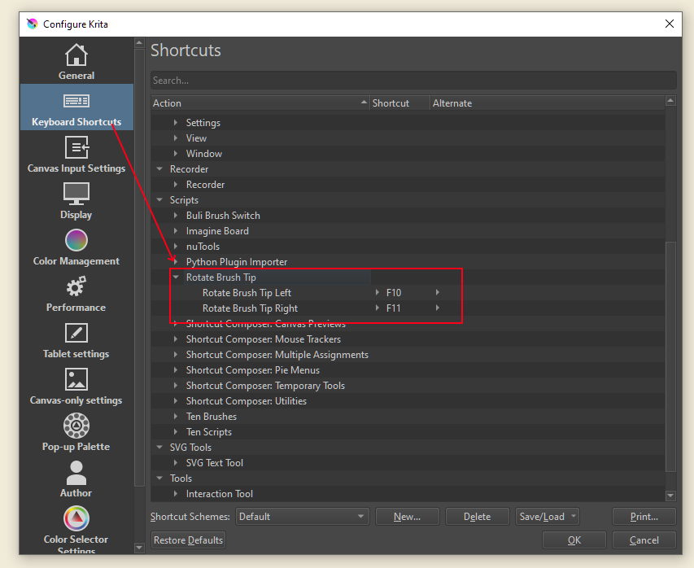

# Rotate Brush Tip

An extension for [Krita](https://krita.org).

## What is Rotate Brush Tip? 
 
*RotateBrushTip* is an experimental Krita Extension that allows assigning shortcut for rotating brush tip. 
It does this by walking down the elements in Brush Editor until it found the corresponding input for brush tip angle and assigning a value to that. 
Currently it rotates at 5 degree increment

## Assigning Shortcut Key

Open Settings -> Configure Krita -> Krita Shortcuts

Look for Rotate Brush Tip and Assign your preferred shortcuts.

Default shortcuts : 
Rotate CCW  : F10
Rotate CW   : F11

 

**Under construction**
